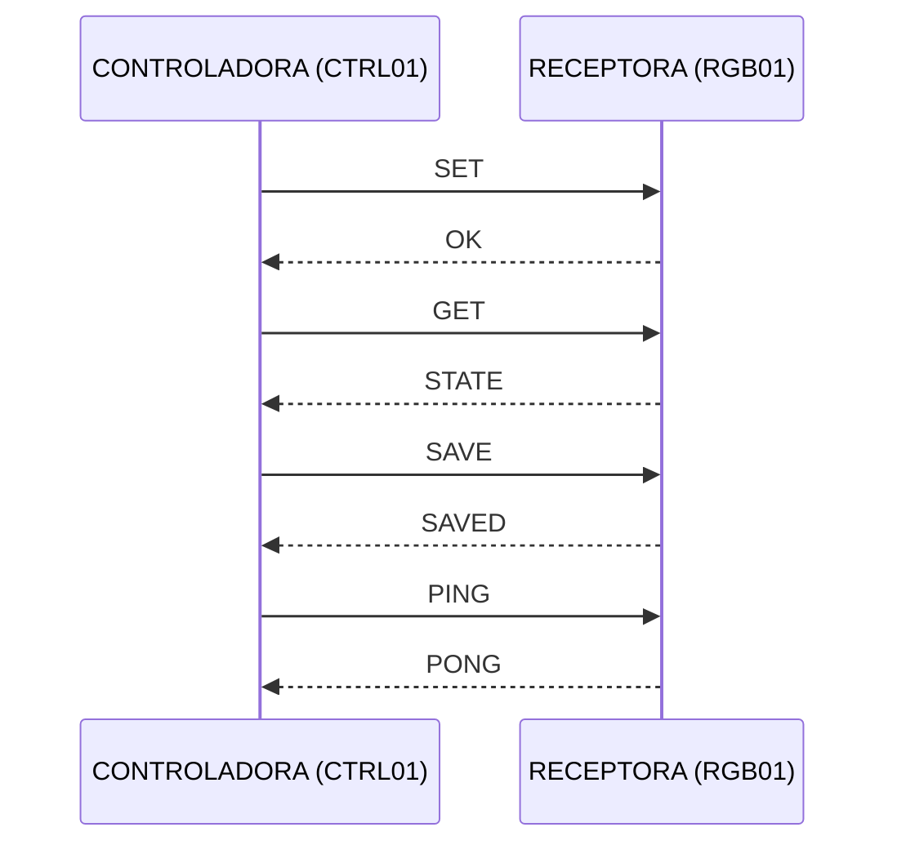

# 🎨 Sistema de Control RGB Bidireccional con micro:bit

Sistema inalámbrico compuesto por dos micro:bits que se comunican por radio mediante un protocolo de texto simple, basado en mensajes separados por `|`.

| Dispositivo | ID | Función |
|---|---|---|
| **Controladora** | `CTRL01` | Modifica los valores RGB, guarda la configuración, consulta el estado y comprueba la conexión. |
| **Receptora** | `RGB01` | Recibe los comandos, controla los valores RGB y responde a la controladora. |

La comunicación es **bidireccional**: ambas micro:bits pueden enviar y recibir mensajes.

---

## 📑 Índice

1. [Arquitectura](#-arquitectura)
2. [Configuración](#-configuración)
3. [Protocolo](#-protocolo)
4. [Comandos](#-comandos)
5. [Validación de mensajes](#-validación-de-mensajes)
6. [Receptora: controles locales y salidas RGB](#-receptora-controles-locales-y-salidas-rgb)
7. [Controladora: menú](#-controladora-menú)
8. [Ejemplos completos](#-ejemplos-completos)
9. [Estructura del proyecto](#-estructura-del-proyecto)
10. [Archivo `color.txt`](#-archivo-colortxt)
11. [Seguridad](#-seguridad)
12. [Ventajas del protocolo](#-ventajas-del-protocolo-simplificado)
13. [Futuras mejoras](#-futuras-mejoras)

---

## 🏗️ Arquitectura

Ambas micro:bits usan el **grupo de radio 25**.



<details>
<summary>Versión en texto plano</summary>

```text
                 RADIO GRUPO 25
                       │
          ┌────────────┴────────────┐
          │                         │
          ▼                         ▼
     CONTROLADORA               RECEPTORA
       CTRL01                    RGB01
          │                         │
          │────── SET ─────────────>│
          │<───── OK ───────────────│
          │────── GET ─────────────>│
          │<──── STATE ─────────────│
          │────── SAVE ────────────>│
          │<──── SAVED ─────────────│
          │────── PING ────────────>│
          │<──── PONG ──────────────│
```

</details>

---

## ⚙️ Configuración

### Controladora

| Parámetro | Valor |
|---|---|
| `ID` | `CTRL01` |
| `RECEPTOR_ID` | `RGB01` |
| `RADIO_GROUP` | `25` |
| `CLAVE` | `MICRO123` |

### Receptora

| Parámetro | Valor |
|---|---|
| `ID` | `RGB01` |
| `CONTROLADORA_ID` | `CTRL01` |
| `RADIO_GROUP` | `25` |
| `CLAVE` | `MICRO123` |

> [!IMPORTANT]
> Las dos micro:bits deben utilizar **el mismo grupo de radio y la misma clave**.

---

## 📡 Protocolo

El separador de campos es el carácter `|`.

Formato general:

```text
COMANDO|CLAVE|ORIGEN|DESTINO|DATOS
```

Ejemplo:

```text
SET|MICRO123|CTRL01|RGB01|G|100
```

| Campo | Valor | Significado |
|---|---|---|
| Comando | `SET` | Modificar un valor RGB |
| Clave | `MICRO123` | Clave compartida |
| Origen | `CTRL01` | Dispositivo que envía |
| Destino | `RGB01` | Dispositivo destinatario |
| Dato 1 | `G` | Color verde |
| Dato 2 | `100` | Nuevo valor |

---

## 🧩 Comandos

Resumen rápido:

| Comando | Respuesta | Descripción |
|---|---|---|
| `SET` | `OK` | Modifica un color |
| `SAVE` | `SAVED` | Guarda los valores en `color.txt` |
| `GET` | `STATE` | Consulta los valores actuales |
| `PING` | `PONG` | Comprueba si la receptora está disponible |
| *(cualquiera inválido)* | `ERROR` | Indica el motivo del rechazo |

### `SET` — Modificar un color

| Color | Mensaje |
|---|---|
| 🔴 Rojo | `SET\|MICRO123\|CTRL01\|RGB01\|R\|500` |
| 🟢 Verde | `SET\|MICRO123\|CTRL01\|RGB01\|G\|100` |
| 🔵 Azul | `SET\|MICRO123\|CTRL01\|RGB01\|B\|800` |

Los valores RGB están comprendidos entre **0 y 1023**:

- Si se recibe un valor **superior a 1023**, la receptora lo limita a `1023`.
- Si se recibe un valor **inferior a 0**, lo limita a `0`.

**Respuesta `OK`**: cuando la receptora procesa correctamente un `SET`, responde:

```text
OK|MICRO123|RGB01|CTRL01|G|100
```

Así la controladora sabe que el cambio fue recibido y aplicado.

### `SAVE` — Guardar la configuración

La controladora envía:

```text
SAVE|MICRO123|CTRL01|RGB01
```

La receptora guarda los valores en `color.txt` (por ejemplo `500,100,800`) y responde:

```text
SAVED|MICRO123|RGB01|CTRL01
```

La controladora puede mostrar: `GUARDADO OK`.

### `GET` — Consultar el estado

La controladora envía:

```text
GET|MICRO123|CTRL01|RGB01
```

La receptora responde:

```text
STATE|MICRO123|RGB01|CTRL01|500|100|800
```

Los valores representan `R = 500`, `G = 100`, `B = 800`. La controladora puede mostrar:

```text
RGB01 ESTADO

R: 500
G: 100
B: 800
```

De esta forma la controladora obtiene el **estado real** de la receptora.

### `PING` — Comprobar la conexión

La controladora envía:

```text
PING|MICRO123|CTRL01|RGB01
```

La receptora responde:

```text
PONG|MICRO123|RGB01|CTRL01
```

| Situación | Pantalla de la controladora |
|---|---|
| Se recibe `PONG` | `CONECTADO` |
| No hay respuesta tras un tiempo determinado | `SIN RESPUESTA` |

### `ERROR` — Mensaje incorrecto

Si la receptora recibe un mensaje incorrecto, puede responder:

```text
ERROR|MICRO123|RGB01|CTRL01|MOTIVO
```

Ejemplos:

```text
ERROR|MICRO123|RGB01|CTRL01|CLAVE
ERROR|MICRO123|RGB01|CTRL01|DESTINO
```

| Motivo | Causa |
|---|---|
| `CLAVE` | La clave no coincide |
| `DESTINO` | El destino no es `RGB01` |
| `ORIGEN` | El origen no es `CTRL01` |
| `COMANDO` | Comando desconocido |
| `VALOR` | Valor fuera de rango o inválido |
| `FORMATO` | Mensaje mal formado |

---

## ✅ Validación de mensajes

Antes de ejecutar un comando, la receptora debe comprobar que:

- [ ] El mensaje tiene el **formato** correcto.
- [ ] La **clave** es correcta.
- [ ] El **destino** es `RGB01`.
- [ ] El **origen** es `CTRL01`.
- [ ] El **comando** es válido.
- [ ] Los **valores RGB** están dentro del rango permitido.

Por ejemplo, este mensaje debe rechazarse porque la clave no coincide:

```text
SET|OTRACLAVE|CTRL01|RGB01|R|500
```

---

## 🔌 Receptora: controles locales y salidas RGB

### Controles locales

La receptora puede disponer de controles locales. Una posible configuración:

| Control | Acción |
|---|---|
| `A + B` | Entrar / salir del modo configuración |
| `A` | Aumentar valor |
| `B` | Cambiar color (ROJO → VERDE → AZUL) |
| `LOGO` | Aumentar valor |

Los valores pueden modificarse localmente y luego guardarse en `color.txt`.

### Salidas RGB

| Pin | Color | Posición en `colors[]` |
|---|---|---|
| `P0` | 🔴 Rojo | `colors[0]` |
| `P1` | 🟢 Verde | `colors[1]` |
| `P2` | 🔵 Azul | `colors[2]` |

Ejemplo:

```python
colors[0] = 500   # Rojo
colors[1] = 100   # Verde
colors[2] = 800   # Azul
```

Después de modificar los valores se actualizan las salidas RGB.

---

## 🖥️ Controladora: menú

```text
> ROJO
  VERDE
  AZUL
  GUARDAR
  ESTADO
  CONECTAR
```

Al seleccionar un color se muestra:

```text
COLOR: GREEN

100 / 1023

A = +20
B = ENVIAR
```

- Cada pulsación de **A** suma 20: `100 → 120 → 140 → 160 → ...`
- Cuando el valor supera `1023`, vuelve a `0`.
- Al pulsar **B**, se envía el valor a la receptora.

---

## 🔁 Ejemplos completos

### Establecer el verde en 100

**1.** La controladora envía:

```text
SET|MICRO123|CTRL01|RGB01|G|100
```

**2.** La receptora comprueba:

| Elemento | Resultado |
|---|---|
| Clave | ✅ correcta |
| Origen | ✅ `CTRL01` |
| Destino | ✅ `RGB01` |
| Comando | ✅ `SET` |
| Color | ✅ `G` |
| Valor | ✅ `100` |

**3.** Modifica `colors[1] = 100`, actualiza el RGB y responde:

```text
OK|MICRO123|RGB01|CTRL01|G|100
```

**4.** La controladora muestra:

```text
OK
GREEN = 100
```

### Guardar

```text
SAVE|MICRO123|CTRL01|RGB01      (controladora → receptora)
```

La receptora escribe `500,100,800` en `color.txt` y responde:

```text
SAVED|MICRO123|RGB01|CTRL01
```

### Consultar

```text
GET|MICRO123|CTRL01|RGB01                 (controladora → receptora)
STATE|MICRO123|RGB01|CTRL01|500|100|800   (receptora → controladora)
```

La controladora muestra:

```text
RGB01 ESTADO

R:500
G:100
B:800
```

---

## 📁 Estructura del proyecto

```text
proyecto/
│
├── README.md
│
├── controladora/
│   └── main.py
│
└── receptora/
    ├── main.py
    └── color.txt
```

---

## 💾 Archivo `color.txt`

Contiene los tres valores RGB separados por comas, **siempre en el orden** `ROJO,VERDE,AZUL`:

```text
500,100,800
```

| Posición | Valor | Color |
|---|---|---|
| 1 | `500` | Rojo |
| 2 | `100` | Verde |
| 3 | `800` | Azul |

---

## 🔒 Seguridad

La clave compartida `MICRO123` permite que la receptora rechace mensajes que no usan la clave configurada.

> [!WARNING]
> Esta clave **no proporciona cifrado criptográfico**.

El sistema actual sirve principalmente para:

- Evitar interacciones accidentales.
- Identificar dispositivos.
- Rechazar mensajes de dispositivos no autorizados.
- Mantener una comunicación sencilla.

Para aumentar la seguridad en una versión futura se podrían incorporar:

- Autenticación
- `CHECKSUM` para comprobar integridad
- Números de secuencia
- `CHALLENGE/RESPONSE`
- Cifrado
- Rotación de claves

---

## ✨ Ventajas del protocolo simplificado

Está pensado para ser fácil de implementar y depurar en micro:bit. Por ejemplo:

```text
SET|MICRO123|CTRL01|RGB01|R|500
```

es mucho más sencillo de interpretar que un mensaje con múltiples campos y comandos anidados.

| Tipo | Mensajes |
|---|---|
| Comandos principales | `SET`, `SAVE`, `GET`, `PING` |
| Respuestas | `OK`, `SAVED`, `STATE`, `PONG`, `ERROR` |

Esto mantiene el código pequeño y facilita las pruebas mediante mensajes de radio.

---

## 🚀 Futuras mejoras

- [ ] Múltiples receptoras
- [ ] Selección de dispositivos desde la OLED
- [ ] Números de secuencia
- [ ] Confirmación de recepción
- [ ] Detección de mensajes duplicados
- [ ] `CHECKSUM`
- [ ] Handshake de conexión
- [ ] Autenticación más robusta
- [ ] Cifrado
- [ ] Configuración de varios dispositivos simultáneamente

Una futura implementación podría mostrar:

```text
> DISPOSITIVOS

  RGB01 ✓
  RGB02 ✓
  RGB03 ?
```

La controladora podría seleccionar uno o varios dispositivos y enviarles los mismos valores RGB.

---

## 📝 Resumen

Dos micro:bits comunicadas por radio, con el protocolo:

```text
COMANDO|CLAVE|ORIGEN|DESTINO|DATOS
```

Con este sistema, la controladora puede **modificar, guardar y consultar** remotamente el RGB de la receptora mediante una comunicación inalámbrica bidireccional sencilla.
